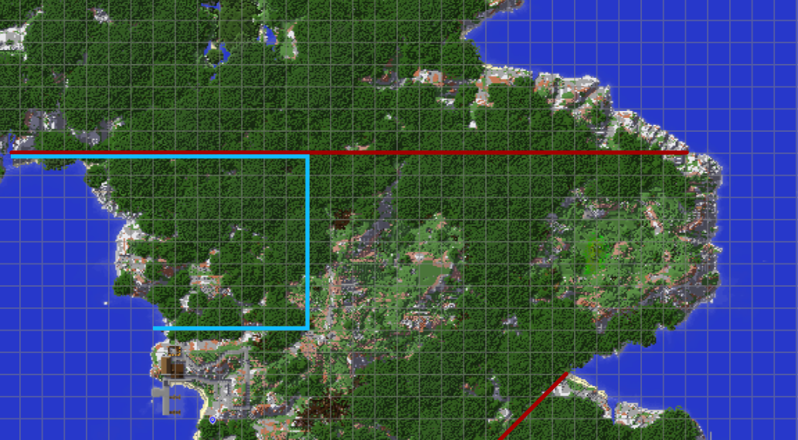

Effective immediately, the area within the blue is hereby the Knoxmoor National Park. Building and destroying the natural terrain in this area is hereby prohibited. Exceptions may be granted by the Ministry of the Interior. Building and desecrating the terrain can carry fines up to 50 stamina.

