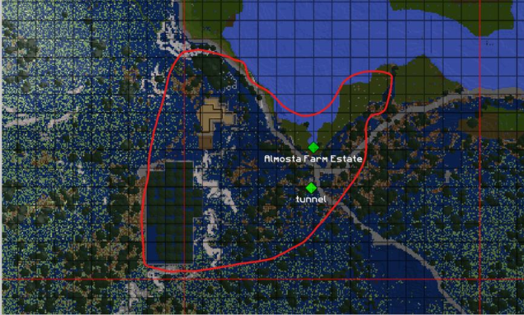
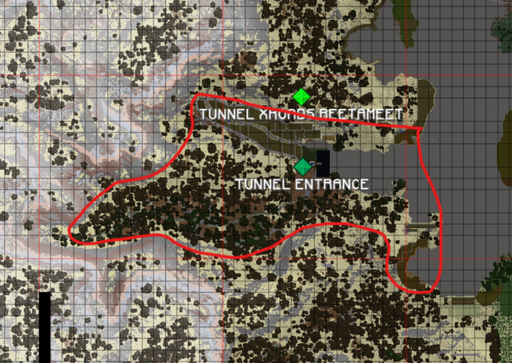

**The Honourable Prime Minister of the Kingdom of Norlund and the Jarl of the Ansgar Vikings**

ACKNOWLEDGING the desire of the Ansgar Vikings to exercise their right to self determination,

DESIROUS of securing and promoting a strong and durable peace in the region,

Have accordingly appointed their plenipotentiaries who, having exhibited their full powers found in good and due form, have agreed as follows:

1. For the purposes of this Treaty:
    1. the term “Ansgar” means the Ansgar Vikings (a State);
    2. the term “ceded lands” means the land that comprised the canton of Ansgar immediately prior to secession excluding the exclave under the south shore of Lake Veria, as ceded by the terms of this Treaty;
    3. the term “Norlund” means the Kingdom of Norlund (a State);
    4. the term “secession” means the secession of the canton of Ansgar from the Kingdom of Norlund, as effected by the public announcement made by Ansgar but does not include any statements concerning land claims in that announcement.
2. The Contracting States acknowledge that Norlund continues in existence as the state of the Kingdom of Norlund immediately prior to secession and that its Constitution continues in operation.
3. Ansgar acknowledges that it has released all sovereign claims to lands not ceded by this Treaty.
4. Norlund gives, transfers and grants and confirms unto Ansgar (including the heirs and successors forever thereof) the ceded lands with all the rights, profits, territories and appurtenances whatsoever thereunto belonging, and as well the profits and revenue as the direct, full, and absolute dominion and sovereignty of the said territory, with all royalties thereof, freely, fully and entirely and absolutely.
5. In the transfer of lands, this Treaty will be proof that there are no other native claims upon it, and for this purpose Ansgar will be permitted to use it as hitherto.
6. Norlund agrees to allow, for as long as the terms of this Treaty are complied with, citizens of Ansgar, who are not criminals under Norlund law (for an offence committed after this Treaty comes into force), free and unimpeded access to the following—
    1. the aqua nether portal in Kannin;
    2. any private buildings (including homes, apartments, stores and shopfronts) built and owned by that citizen in Norlund;
    3. the farms (and structures built on that farmland) owned and maintained by that citizen in Norlund that are listed in the Schedule;
    4. the tunnel (that exists at the time this Treaty comes into force) between Ansgar and anything listed in paragraph (c), provided that the tunnel is not enlarged.
    and the Contracting States acknowledge that these rights are granted, and extend, only to those individuals in a private capacity and not to Ansgar.
7. Ansgar agrees to do everything necessary to ensure that Norlund receives ownership of the following NameLayer groups, if it does not already—
    1. NorlundCit;
    2. Norlund_Snitches;
    3. NorlundSecure.
8. Ansgar agrees to give Norlund, within 48 hours of this Treaty coming into force, a list of all citizens of Ansgar at that point in time.
9. The Contracting Parties each agree to respect the other Party’s territorial integrity.
10. This Treaty will continue to apply to any Power that succeeds either Contracting State.

IN WITNESS WHEREOF the undersigned, duly authorised thereto by their respective Governments, have signed this Treaty.

DONE at Kannin, this ninth day of June 2020, in the English language.

For the Kingdom of Norlund:  
Jacob Grox  
The Hon. Jacob Grox  
Prime Minister

For the Ansgar Vikings:  
Shamus Shameless  
Shameless Shamus  
Jarl of the Ansgar Vikings

## SCHEDULE — Farms owned and maintained by Ansgar citizens

### Tallum

The farm bounded by the bright red polygon in the following image:

### Near Florentia

The farms bounded by the bright red polygon in the following image:

