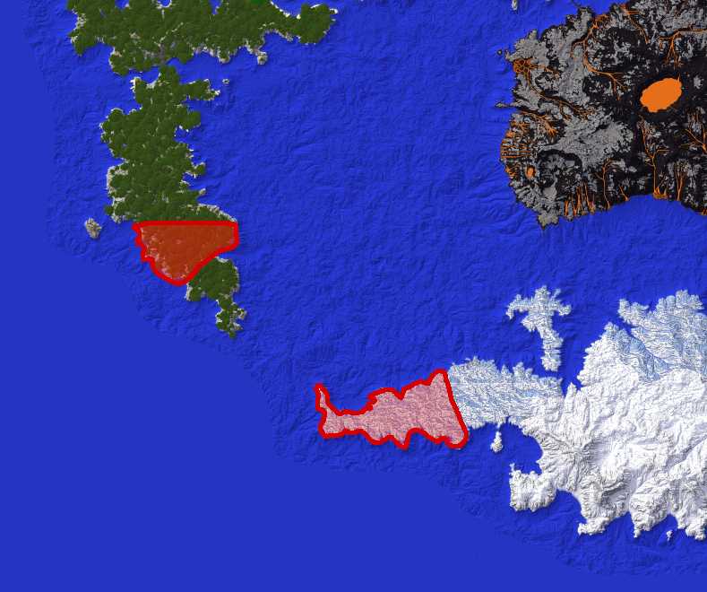

### Article 1

In the pursuit of peace, friendship, and a common understanding, the Senate and People of Roma, as of this date on the third of August, 2020; cede all Roman territory in the new world of Kingsluund to the Kingdom of Norlund.

The S.P.Q.R. will cooperate in any way necessary to transfer bastions and groups in Kingsluund to the Kingdom of Norlund.

### Article 2

The Kingdom of Norlund will allow S.P.Q.R. to mine for tin in their claims; with the condition to not destroy the natural terrain. 

For the Kingdom of Norlund:  
Leobonet, King of Norlund  
Jacob Grox, Prime Minister of Norlund  
KannonKyle, Foreign Affairs Minister of Norlund  
Cortwade, Minister of the Interior of Norlund  
Zamoradin, Minister of Defense of Norlund

For the Senate and People of Roma:  
Consul and Founding Mother of the S.P.Q.R.: NovaCeasar  
Consul and Founding Father of the S.P.Q.R.: Alberlb96